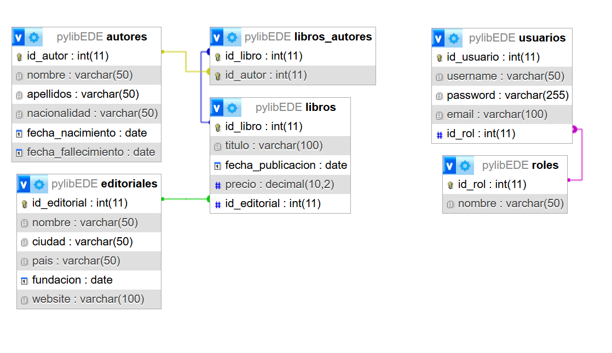

```markdown
# PyLib - Sistema de Gestión Bibliotecaria 📚
```

Aplicación para administrar libros, autores y 
editoriales con interfaz gráfica (Tkinter) y arquitectura MVC.

## 🗃️ Estructura de la Base de Datos
```sql - MariaDb
# 📚 Diagrama de Relaciones de la Base de Datos
```
## Tablas y Relaciones:




## 🐍 Arquitectura MVC


**Planificación de Interfaces:**
0. **Formulario de Auth**
   - Formulario de inicio de sesión
   - Formulario de registro

1. **Ventana Principal**
   - Menú con acceso a los módulos
   - Listado dinámico de registros

2. **Formulario Libros**
   - Campos: Título, Fecha, Precio, Selector Editorial
   - Botones: Guardar/Editar, Eliminar, Limpiar
   - Tabla con libros existentes

3. **Formulario Autores**
   - Campos: Nombre, Apellidos, Nacionalidad, Fechas
   - Validación de datos obligatorios

4. **Gestión Relaciones**
   - Selector de libro + Listado de autores
   - Checkboxes para asignar/desasignar autores

### **Controladores**
```python
# controladores/
├── libro_controller.py   # Media entre LibroModel y libros_view
└── autor_controller.py   # Gestiona lógica de autores
```

## 🛠️ Instalación
1. Clonar repositorio
2. Instalar dependencias:
   ```bash
   pip install mysql-connector-python tkinter
   ```
3. Ejecutar aplicación principal:
   ```python
   python main.py
   ```

## 📋 Funcionalidades Clave
- CRUD completo para cada entidad
- Relaciones muchos-a-muchos visuales
- Validación de datos en tiempo real


## 🗂️ Estructura del Proyecto
```
📦 PyLib
├── 📂 config
│   └── database.py       # Configuración de conexión a DB
├── 📂 models
│   ├── Autor.py
│   ├── Editorial.py
│   ├── Libro.py
│   └── Usuarios.py
├── 📂 views
│   ├── libros.py
│   ├── autores.py
│   ├── editoriales.py
│   ├── login.py
│   └── register.py
├── 📂 controllers
│   ├── LibrosController.py
│   ├── AutoresController.py
│   ├── EditorialesController.py
│   └── AuthController.py
└── main.py               # Punto de entrada
```

## 🔄 Flujo MVC
1. **Usuario** interactúa con la vista (ej: formulario de libro)  
2. **Controlador** recibe la acción y valida datos  
3. **Modelo** ejecuta operaciones en la base de datos  
4. **Vista** actualiza la interfaz con los cambios  
