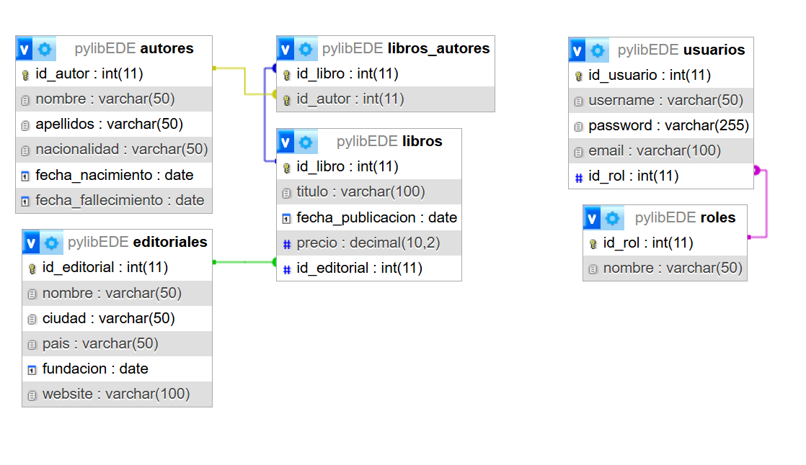
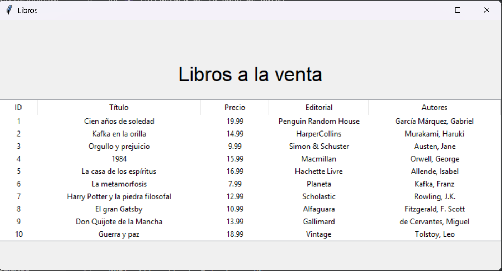
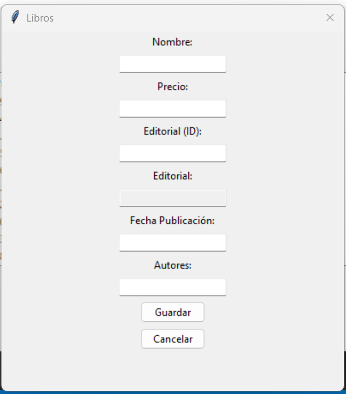
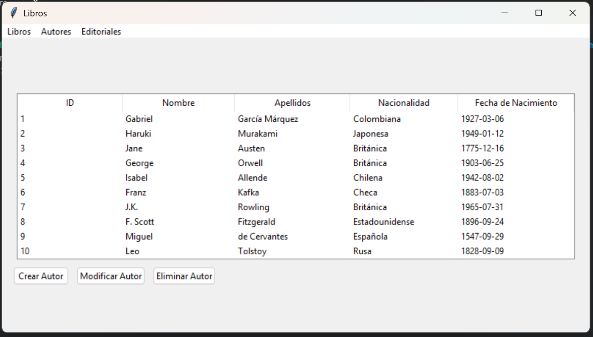

```markdown
# PyLib - Sistema de Gestión Bibliotecaria 📚
```

Aplicación para administrar libros, autores y 
editoriales con interfaz gráfica (Tkinter) y arquitectura MVC.

## 🗃️ Estructura de la Base de Datos
```sql - MariaDb
CREATE TABLE IF NOT EXISTS autores
CREATE TABLE IF NOT EXISTS editoriales
CREATE TABLE IF NOT EXISTS libros
CREATE TABLE IF NOT EXISTS libros_autores
CREATE TABLE IF NOT EXISTS roles
CREATE TABLE IF NOT EXISTS usuarios
```
## 📚 Diagrama de Relaciones de la Base de Datos

### Tablas y Relaciones:



## 🗔 Vistas Propuestas

### Vistas de Libros:




### Vistas de Autores:




### 🐍 Arquitectura MVC


**Planificación de Interfaces:**
0. **Formulario de Auth**
   - Formulario de inicio de sesión
   - Formulario de registro

1. **Ventana Principal**
   - Menú con acceso a los módulos
   - Listado dinámico de registros

2. **Formulario Libros**
   - Campos: Título, Fecha, Precio, Selector Editorial
   - Botones: Guardar/Editar, Eliminar, Limpiar
   - Tabla con libros existentes

3. **Formulario Autores**
   - Campos: Nombre, Apellidos, Nacionalidad, Fechas
   - Validación de datos obligatorios

4. **Gestión Relaciones**
   - Selector de libro + Listado de autores
   - Checkboxes para asignar/desasignar autores

### **Controladores**
```python
# controladores/
├── libro_controller.py   # Media entre LibroModel y libros_view
└── autor_controller.py   # Gestiona lógica de autores
```

## 🛠️ Instalación
1. Clonar repositorio
2. Instalar dependencias:
   ```bash
   pip install mysql-connector-python tkinter
   ```
3. Entra a la carpeta principal y ejecuta docker-compose up -d --build
   Es necesario para levantar la base de datos y phpmyadmin como cliente para insertar
   consultas sql.

4. La consulta SQL esta en este archivo ➡️ [tabla sql](table-autores.sql) 

5. Crea tu config.env basandote en el ejemplo y sustituye
   tus datos por los necesarios a la conexión:

6. Ejecutar aplicación principal:
   ```python
   python main.py
   ```

## 📋 Funcionalidades Clave
- CRUD completo para cada entidad
- Relaciones muchos-a-muchos visuales
- Validación de datos en tiempo real


## 🗂️ Estructura del Proyecto  y Clases 
```
Un archivo representa una Clase del mismo nombre para organizar y facilitar el trabajo
de importación. El archivo Base View Maneja los controladores y los muestra en la ventana.
Aunque son muchos archivos modulariza la aplicación y permite un código mas organizado y legible mienstras permite la escalabilidad.
```
```
📦 PyLib
├── 📂 config
│   ├── config.ini
│   └── database.py       # Configuración de conexión a DB
├── 📂 app
│   ├── 📂 autores
│   │   ├── AutoresView.py
│   │   ├── FormView.py
│   │   └── AutoresController.py
│   ├── 📂 libros
│   │   ├── LibrosView.py
│   │   ├── FormView.py
│   │   └── LibrosController.py
│   ├── 📂 editoriales
│   │   ├── EditorialesView.py
│   │   ├── FormView.py
│   │   └── EditorialesController.py 
│   └── 📂 models
│   │   ├── BaseModel.py
│   │   └── Libro.py 
├── BaseView.py             # Vista Base encargada de Transición entre Frames
└── main.py               # Punto de entrada
```

## 🔄 Flujo MVC
1. **Usuario** interactúa con la vista (ej: formulario de libro)  
2. **Controlador** recibe la acción y valida datos  
3. **Modelo** ejecuta operaciones en la base de datos  
4. **Vista** actualiza la interfaz con los cambios

